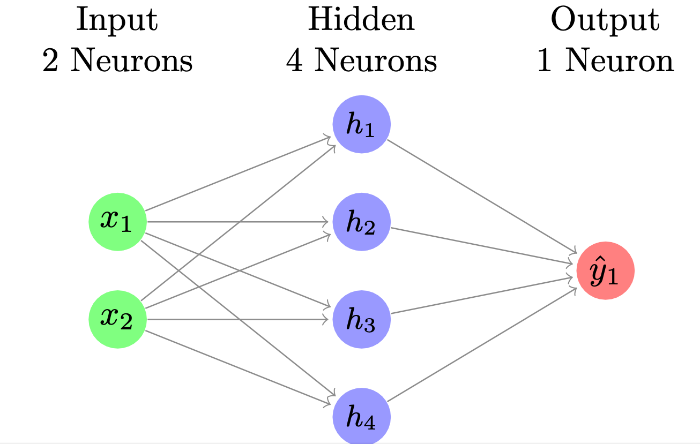

# neural-network-autograd-cpp
A simple neural network (with autograd!) in C++ (no external libarys like Eigen).

## Usage

### Creating a NeuralNetwork

#### OR-Gate problem

```cpp
#include "./NeuralNetwork.h"
#include <iostream>

int main() {
    {
    // This neural network learns how to solve the OR-Gate problem.

    // Training data. 
    Matrix<float> X_train =
        std::vector<std::vector<float>>({{0, 0}, {0, 1}, {1, 0}, {1, 1}});

    Matrix<float> y_train_or =
        std::vector<std::vector<float>>({{0}, {1}, {1}, {1}});
    
    // Create the neural net.
    // w1= 2 x 1, activation sigmoid. 
    NeuralNetwork<float> orGate(std::vector<size_t>({2, 1}),
                                std::vector<Activation>({Activation::sigmoid}),
                                0.1f, InitState::RANDOM);
    orGate.train(X_train, y_train_or, 0.1f, 10000, false);
    orGate.act(X_train).print();
    }
}
```
##### Output

```shell
matrix([[0.0205522],
[0.989617],
[0.989618],
[0.999998]])
```

#### XOR-Gate problem

```cpp
#include "./NeuralNetwork.h"
#include <iostream>

int main() {
    {
    // This neural network learns how to solve the XOR-Gate problem.
    
    // Training data. 
    Matrix<float> X_train =
        std::vector<std::vector<float>>({{0, 0}, {0, 1}, {1, 0}, {1, 1}}); 
    Matrix<float> y_train =
        std::vector<std::vector<float>>({{0}, {1}, {1}, {0}});


    // Create the neural net.
    // w1 = 2 x 4 with relu
    // w2 = 4 x 1 with sigmoid
    NeuralNetwork<float> xorGate(
        std::vector<size_t>({2, 4, 1}),
        std::vector<Activation>({Activation::relu, Activation::sigmoid}),
        0.88f, InitState::RANDOM);

    xorGate.train(X_train, y_train_xor, 0.1f, 10000, false);
    xorGate.act(X_train).print();
    }
}
```
###### The neural network would look like this.



##### Output

```shell
matrix([[0.0145205],
[0.979574],
[0.979554],
[0.0177436]])
```

